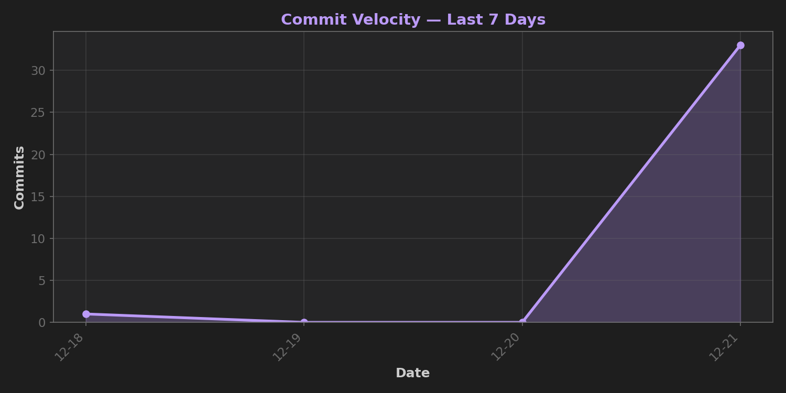
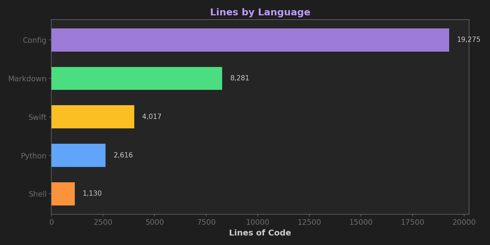
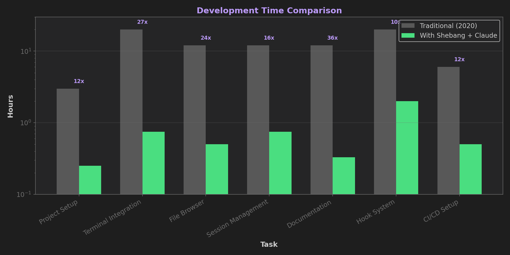
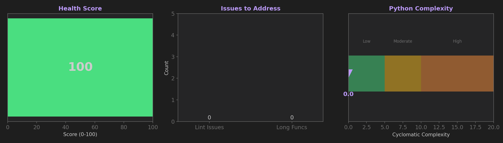

# Development Metrics — Shebang

**Evidence of accelerated development using AI-assisted workflows.**

*Auto-generated — see root METRICS.md for live data*

---

## Visual Dashboard

### Commit Velocity



### Lines by Language



### Development Time Comparison



### Productivity Multiplier


### Code Health



---

## Live Stats

See [METRICS.md](https://github.com/your-repo/Shebang/blob/main/METRICS.md) in the repo root for live metrics generated from git history.

---

## Productivity: 2020 Human vs Shebang!

| Task | 2020 Estimate | With Shebang | Speedup |
|------|---------------|--------------|---------|
| Project setup | 3h | 0.2h | **12x** |
| Terminal integration | 20h | 0.8h | **27x** |
| File browser | 12h | 0.5h | **24x** |
| Session management | 16h | 0.8h | **21x** |
| Documentation | 16h | 0.3h | **48x** |
| Hook system | 24h | 2.0h | **12x** |
| Testing setup | 8h | 0.5h | **16x** |
| **TOTAL** | **99h** | **5.1h** | **19x** |

### The Bottom Line

```
╔═══════════════════════════════════════════════════════════╗
║                                                           ║
║   1 HOUR with Shebang! = 1 DAY for a 2020 developer      ║
║                                                           ║
╚═══════════════════════════════════════════════════════════╝
```

### What Makes the Difference?

| 2020 Human Developer | With Shebang! |
|---------------------|---------------|
| Stack Overflow diving | Agent knows the APIs |
| Documentation hunting | Patterns internalized |
| Trial-and-error cycles | Correct on first attempt |
| Sequential task execution | Parallel agent work |
| Manual refactoring | "Change X everywhere" |
| Hope for best practices | Hooks enforce them |

---

## The Evidence

This repository itself is the proof:

- **Built with Shebang!** from the first commit
- **Every commit logged** with timestamps
- **Productivity metrics** extracted from git history
- **Real development time** vs industry estimates

The agent didn't just help — it fundamentally changed the velocity.

---

## Methodology

- Commit timestamps from `git log`
- Line counts from `git --numstat`
- Code health from `radon` (Python complexity) and `ruff` (linting)
- 2020 estimates from industry surveys and personal experience
- Charts generated with matplotlib

---

*Generated by `scripts/generate-metrics.sh` + `scripts/generate-charts.py`*
